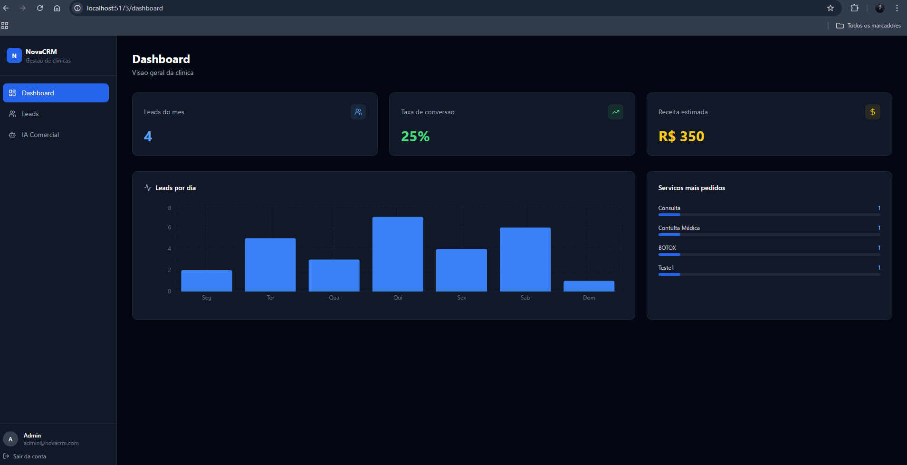
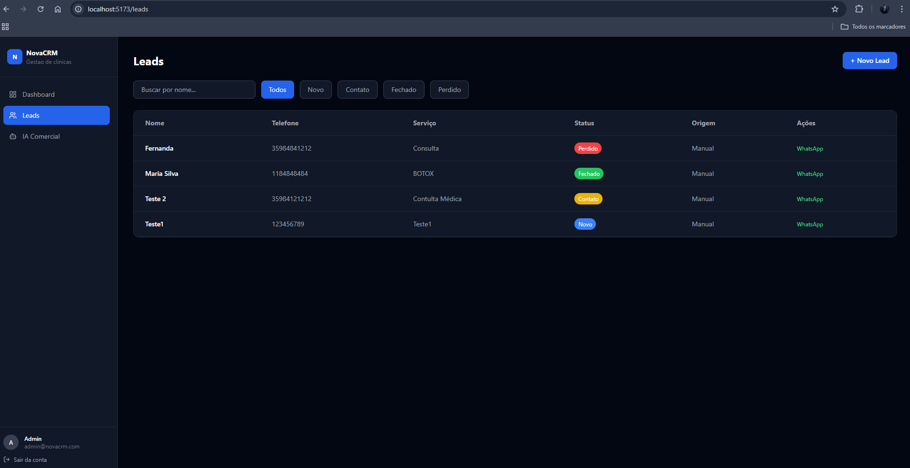
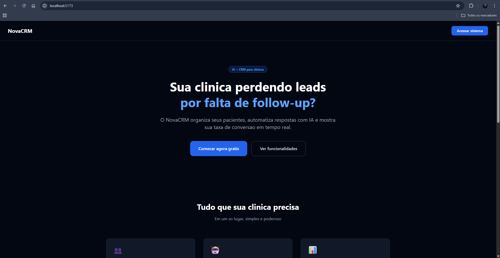

# NovaCRM

> SaaS de gestão de leads para clínicas com IA integrada, autenticação JWT e dashboard em tempo real.
> Projeto construído para simular ambiente de produção real.

🔗 **[Acessar Demo ao Vivo](https://novacrm-omega.vercel.app/)


---

## Screenshots





---

## Funcionalidades

- Login seguro com autenticação JWT
- Dashboard com métricas em tempo real e gráficos
- CRUD completo de leads com filtro, busca e status
- Link direto para WhatsApp por lead
- IA Comercial — resposta automática, reescrita profissional e resumo diário
- Landing page de conversão

---

## Stack

| Camada | Tecnologia |
|---|---|
| Frontend | React + Vite + Tailwind CSS |
| Gráficos | Recharts |
| Ícones | Lucide React |
| Backend | Node.js + Express |
| Autenticação | JWT + bcryptjs |
| Banco de dados | PostgreSQL |
| IA | OpenAI GPT-4o-mini |
| Deploy | Vercel + Railway |

---

## Rodar localmente

```bash
# Backend
cd server
npm install
npm run dev

# Frontend (novo terminal)
cd client
npm install
npm run dev
```

## Variáveis de ambiente

Crie `server/.env` com:
PORT=3001
DB_HOST=localhost
DB_PORT=5432
DB_NAME=novacrm
DB_USER=postgres
DB_PASSWORD=sua_senha
JWT_SECRET=seu_secret
OPENAI_API_KEY=sua_key

---

## Estrutura do projeto
novacrm/
├── client/          # React + Tailwind
│   └── src/
│       ├── components/
│       ├── pages/
│       └── services/
└── server/          # Node + Express
├── controllers/
├── routes/
├── middleware/
└── db/