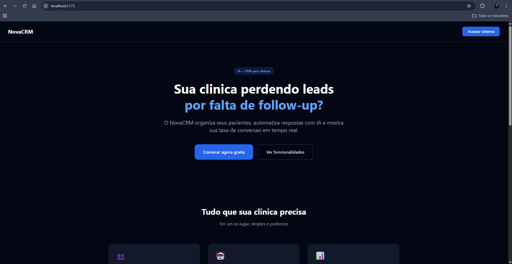
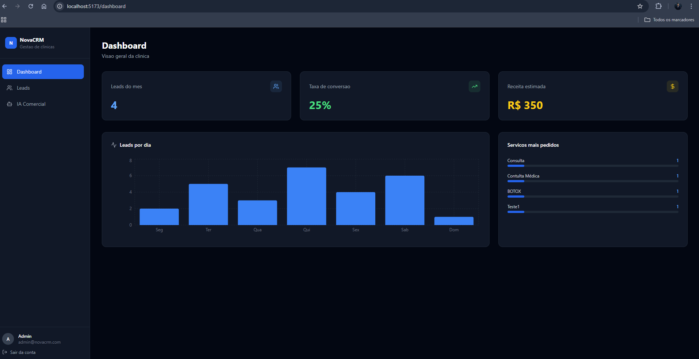
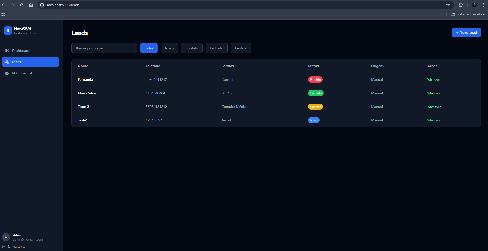

# NovaCRM AI 🚀

CRM inteligente com IA para clínicas e negócios locais.
Organiza leads, acompanha o pipeline comercial e automatiza 
atendimento com Inteligência Artificial.

## 🔗 Demo Online
https://novacrm-omega.vercel.app/

Login de demonstração:
- Email: admin@novacrm.com
- Senha: admin123

---

## 📸 Preview

### Landing Page


### Dashboard


### Gestão de Leads


---

## ✨ Funcionalidades

- Landing page comercial
- Autenticação segura com JWT
- Dashboard com métricas em tempo real
- Gestão completa de leads com pipeline de status
- IA Comercial — geração automática de respostas para pacientes
- IA Comercial — reescrita profissional de mensagens
- IA Comercial — resumo executivo diário dos leads
- Interface responsiva dark theme
- Deploy em produção

---

## 🛠️ Stack

### Frontend
React • JavaScript • Tailwind CSS • Recharts • Vite • Vercel

### Backend
Node.js • Express • PostgreSQL • JWT • bcrypt • Render

### IA
OpenAI API (GPT-4o-mini)

---

## 🏗️ Estrutura do Projeto
NovaCRM/
├── client/               ← Frontend React
│   └── src/
│       ├── components/   ← Componentes reutilizáveis
│       ├── pages/        ← Landing, Login, Dashboard, Leads, IA
│       ├── services/     ← Integração com a API
│       └── context/      ← Gerenciamento de estado
├── server/               ← Backend Node.js
│   ├── controllers/      ← aiController, authController, leadController
│   ├── routes/           ← Rotas da API REST
│   ├── middleware/        ← Autenticação JWT
│   └── db/               ← Conexão PostgreSQL
└── assets/               ← Imagens do projeto

## ⚙️ Como rodar localmente

### Pré-requisitos
- Node.js 18+
- PostgreSQL rodando localmente
- Conta na OpenAI com créditos

### 1. Clone o repositório
```bash
git clone https://github.com/LuuckySilva/NovaCRM.git
cd NovaCRM
```

### 2. Configure o backend
```bash
cd server
npm install
```

Crie o arquivo `.env` dentro de `server/`:
DB_HOST=localhost
DB_PORT=5432
DB_NAME=novacrm
DB_USER=seu_usuario
DB_PASSWORD=sua_senha
OPENAI_API_KEY=sua_chave_openai
JWT_SECRET=seu_segredo_jwt
PORT=3001

Inicie o servidor:
```bash
node index.js
```

### 3. Configure o frontend
```bash
cd ../client
npm install
npm run dev
```

Acesse: `http://localhost:5173`

---

## 🎯 Problema resolvido

Clínicas e negócios locais perdem clientes por falta de organização
e follow-up. O NovaCRM centraliza o pipeline comercial e usa IA
para automatizar o atendimento — reduzindo tempo de resposta
e aumentando conversão.

---

## 👨‍💻 Autor

Lucas Silva
GitHub: https://github.com/LuuckySilva
LinkedIn: https://linkedin.com/in/olucas-silvaa